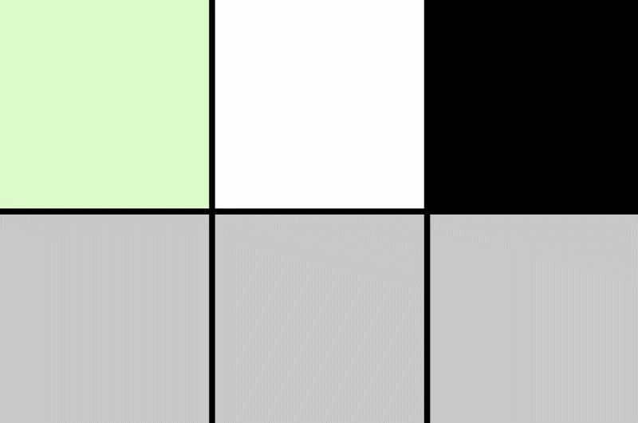
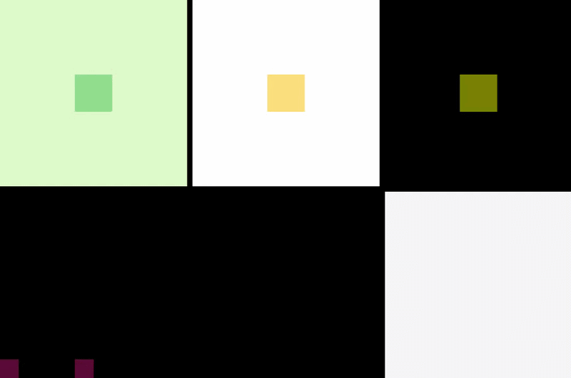
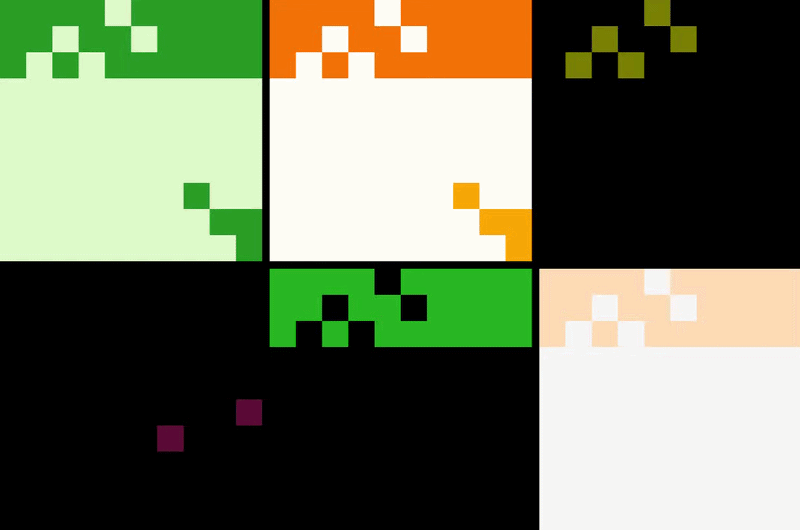
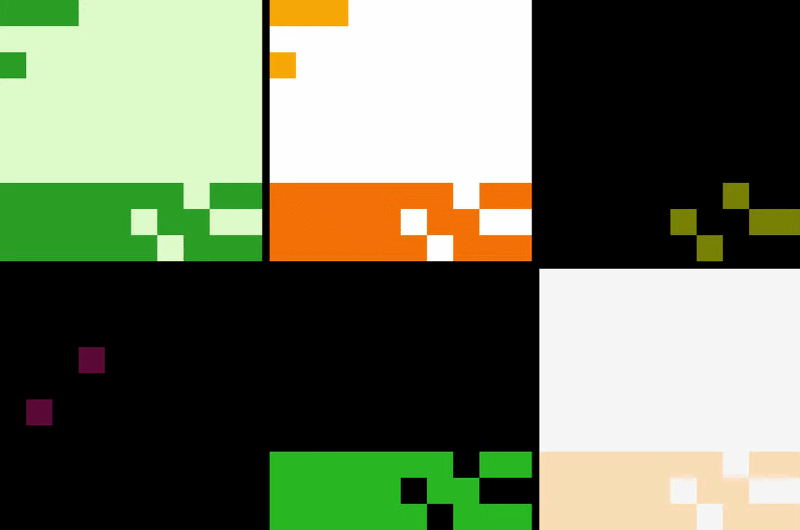
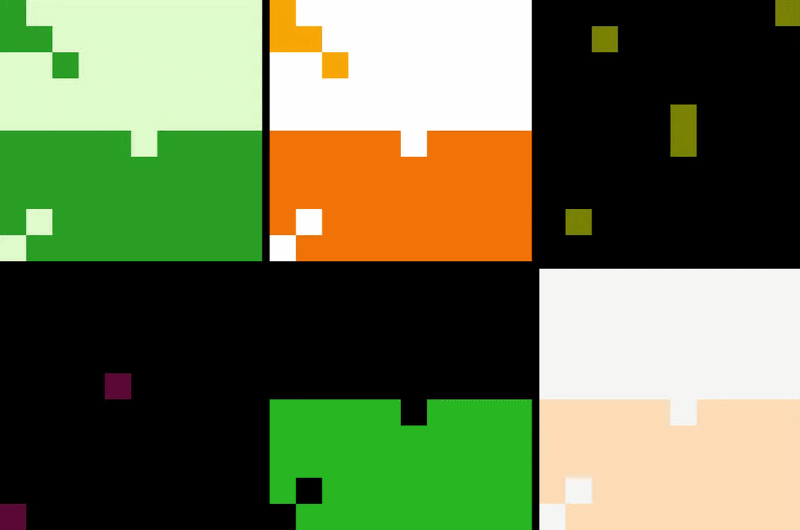
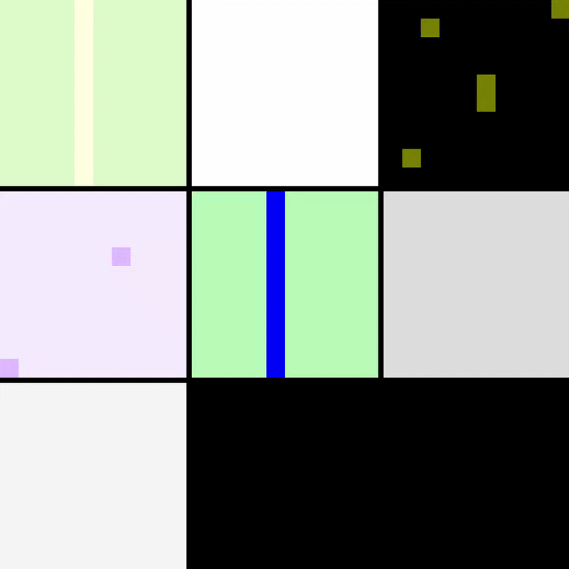

# Cell-DEVS-Bee-Foraging

Cadmium Cell-DEVS model of bee foraging on a 10×10 grid.

Each cell is a nectar patch with nectar, pollen, and bees. Neighbor coupling uses a Von Neumann neighborhood.

## Requirements

- C++17 compiler (`g++`)
- [Cadmium](https://github.com/SimulationEverywhere/cadmium) headers on the include path
- [nlohmann/json](https://github.com/nlohmann/json) on the include path. Example on Linux/macOS:

  ```bash
  mkdir -p ~/libs/nlohmann
  cd ~/libs/nlohmann
  wget https://github.com/nlohmann/json/releases/download/v3.11.2/json.hpp
  ```
  
  Then point `JSON_PATH` at the parent of `nlohmann` (e.g. `make JSON_PATH=$HOME/libs` so `#include <nlohmann/json.hpp>` resolves).

## Layout

| Path | Role |
|------|------|
| `src/main.cpp` | Builds `nectar` |
| `model/nectar_grid.hpp` | Coupled Cell-DEVS grid |
| `model/cells/nectar_cell.hpp` | Local transition \(\tau\) |
| `model/cells/nectarState.hpp` | State struct and JSON parsing |
| `config/nectarVisualization_config.json` | Default demo (center high-activity block) |
| `config/tests/*_config.json` | Test scenarios (tests 1–6) |
| `simulation_results/` | CSV logs and `.webm` recordings |
| `assets/test*.gif` | Short GIF previews for the README (see **Test scenario previews** below) |

## Build

From the repository root (adjust paths for your machine):

```bash
make
# Optional overrides:
# make CADMIUM_PATH=/path/to/cadmium/include JSON_PATH=/path/to/json/include
```

Produces the `nectar` executable.

## Run

```bash
# Defaults: config/nectarVisualization_config.json and simulation_results/grid_log.csv
./nectar

# Explicit paths:
./nectar config/tests/test1_no_bees_config.json simulation_results/test1_grid_log.csv
```

The simulation horizon is **50** time units.

## Make targets

| Target | Config | Log output / effect |
|--------|--------|---------------------|
| `make`  | N/A | Compiles `./nectar` |
| `make clean` | — | Removes the `nectar` binary only (does not delete CSV logs under `simulation_results/`) |
| `make run` | `config/nectarVisualization_config.json` | `simulation_results/grid_log.csv` |
| `make test1` | `config/tests/test1_no_bees_config.json` | `simulation_results/test1_grid_log.csv` |
| `make test2` | `config/tests/test2_center_burst_config.json` | `simulation_results/test2_grid_log.csv` |
| `make test3` | `config/tests/test3_corner_unwrapped_config.json` | `simulation_results/test3_unwrapped_grid_log.csv` |
| `make test4` | `config/tests/test4_corner_wrapped_config.json` | `simulation_results/test4_wrapped_grid_log.csv` |
| `make test5` | `config/tests/test5_multi_species_config.json` | `simulation_results/test5_multi_species_grid_log.csv` |
| `make test6` | `config/tests/test6_river_config.json` | `simulation_results/test6_river_grid_log.csv` |
| `make tests` | runs `test1`–`test6` in order | N/A (writes each test’s CSV under `simulation_results/`) |

`make run` and each `make testN` also filter the produced CSV in place for the Cell-DEVS web viewer (see `FILTER_LOG_FOR_WEB_VIEWER` in the `Makefile`).

## Test scenario previews

Screen captures from the Cell-DEVS web viewer (GIFs under `assets/`).

**Test 1 — no pollinators**  
Two plant species and pollen types, with zero bees and butterflies.



**Test 2 — center foragers**  
Four center bees and two butterflies on an unwrapped grid.



**Test 3 — unwrapped boundaries**  
West species-B band plus southeast species-A hotspot on hard edges (`wrapped: false`).



**Test 4 — wrapped torus**  
Northwest species-A patch and east species-B band on a torus (`wrapped: true`).



**Test 5 — general multi-species reference**  
Wrapped dual-species baseline with five bees and two butterflies.



**Test 6 — river barrier**  
A full river row splits the grid and constrains pollinator movement.   
**Note:** This test is based on a previous version of the simulation based on Asymmetric Cell-DEVS


